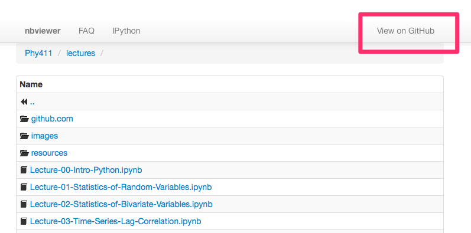

I will try and post regular tips for working with the publishing ecosystem, iPython etc, as they occur to me.  

Today's is spying on me as I work.  The notebooks that make up the [Lectures](http://nbviewer.ipython.org/github/jklymak/Phy411/tree/master/lectures/) and [Assignments](http://nbviewer.ipython.org/github/jklymak/Phy411/tree/master/assigments/) are all version controlled on [GitHub](https://github.com/jklymak/Phy411).  

If you want to be updated on when I change any of the webpages by email, you can click on the "View on Github" link:

Now, at this point you likely need a github account, but they are free and painless (up to your ability to memorize passwords).  At this point you can click "Watch" and you should get an email when I make a commit.  

This *could* be annoying. I tend to commit changes early and often, but it might help you catch a change I make.  
