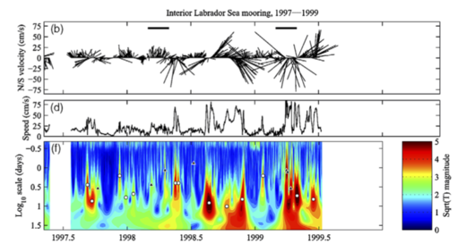

## Physics 411 Time Series Analysis

Fall 2014 (F02)

  - Instructor: [Jody Klymak](http://web.uvic.ca/~jklymak)
  - Office: [Bob Wright Centre](http://www.uvic.ca/buildings/sci.html) A313
  - Tel: (250)-472-5969; Email: [jklymak@uvic.ca](mailto:jklymak@uvic.ca)
  - Office Hours: Tue 14:30-15:30 or by appointment 
  - Meeting time:  TWF 09:30-10:30
  - Location:  [Bob Wright Centre](http://www.uvic.ca/buildings/sci.html) B120 

## Course Objectives ##

  - Understand the basic techniques of time series analysis;
  - Improve statistical reasoning skills;
  - Gain experience handling time series data sets,  visualizing, and interpreting the results using a modern data analysis package;
  - Improve computing skills.
  

## [Lectures and Assigments](./Lectures/)

## [Texts](./Texts/)

## [Computing](./Computing/)

## Course Grading

55% Assignments, 40% Analysis Project; 5% "Class Participation";

Late work penalized as below.  Academic concessions will be granted
with appropriate documentation as per [UVic's regulations](http://www.uvic.ca/registrar/students/policies/appeals/rac-options.php). 

## Mailing list

Please feel free to contact me through the mailing lists:

[201409-phys411-12635@lists.uvic.ca](mailto:201409-phys411-12635@lists.uvic.ca)

To manage your list, have a look at the appropriate page:

 [https://lists.uvic.ca/mailman/listinfo/201409-phys411-12635](https://lists.uvic.ca/mailman/listinfo/201409-phys411-12635)

Questions that will benefit all your classmates are very welcome on
the list. 

